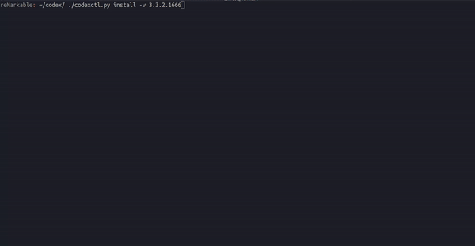

<p align="center">


# Codexctl
A utility program that helps to manage the remarkable device version utilizing [ddvks update server](https://github.com/ddvk/remarkable-update) 

### Installation & Use

This program can be directly ran on the ReMarkable device as well as from a remote device such as your computer, it currently only has support for **command line interfaces** but a graphical interface is soon to come. The steps to install are closely similar apart from the couple of extra depedancies needed for running on a remote device. 

## Downloading compiled binaries
You can directly download the compiled binary from the [releases](https://github.com/Jayy001/codexctl/releases/) page. Just select your operating system & download the zip repo containing the binaries - then open up a terminal and run how you would from there. `./codexctl --help`

## Building from source

```
git clone https://github.com/Jayy001/codexctl.git
cd codexctl
pip install -r requirements.txt
```

Thats it for running it directly on the remarkable. If you are running on a remote device you will need to use Python 3.8 or higher and run the following,

```
pip install wheel
pip install -r requirements.remote.txt
```


The script is designed to have as little interactivity as possible, meaning arguments are directly taken from the command to run the script. 

## Usage 

```
❯ python codexctl.py --help
usage: Codexctl app [-h] [--debug] [--rm1] [--auth AUTH] [--verbose] {install,download,backup,extract,mount,status,restore,list} ...

positional arguments:
  {install,download,backup,extract,mount,status,restore,list}
    install             Install the specified version (will download if not available on the device)
    download            Download the specified version firmware file
    backup              Download remote files to local directory
    extract             Extract the specified version update file
    mount               Mount the specified version firmware filesystem
    status              Get the current version of the device and other information
    restore             Restores to previous version installed on device
    list                List all versions available for use

options:
  -h, --help            show this help message and exit
  --debug               Print debug info
  --rm1                 Use rm1
  --auth AUTH           Specify password or SSH key for SSH
  --verbose             Enable verbose logging
```

# Examples
```
python codexctl.py install latest # Downloads and installs latest version
python codexctl.py download toltec # Downloads latest version that has full support for toltec
python codexctl.py download 3.0.4.1305 --rm1 # Downloads 3.0.4.1305 firmware file for remarkable 1
python codexctl.py status # Prints current & previous version (can only be used when running on device itself)
python codexctl.py list # Lists all available versions 
python codexctl.py restore # Restores previous version
python codexctl.py --verbose # Enables logging
python codexctl.py --backup # Exports all files to local directory
python codexctl.py --backup -l root -r FM --no-recursion --no-overwrite # Exports all files from FM directory to root folder on localhost
python codexctl.py extract 3.8.0.1944_reMarkable2-7eGpAv7sYB.signed # Extracts contents to filesystem named "extracted"
python codexctl.py mount extracted /opt/remarkable # Mounts extracted filesystem to /opt/remarkable
```
