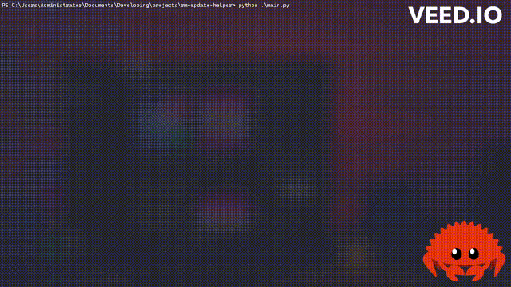

<p align="center">

  
# rm-update-helper (MIGRATIONS IN PROGRESS) 
A quick script that helps to upgrade/downgrade the remarkable device using [ddvks update server](https://github.com/ddvk/remarkable-update)

# How to use?

Firstly, connect your RM over usb. Make sure its reachable.

To run it from source, install the required libs:
```shell
pip install wheel
pip install paramiko rich netifaces requests
```

After you've installed the dependencies you can run the script with the following:

```shell
python main.py
```

When prompted, enter your desired version - (no current supported for the latest 3.x.x & beta versions, eventually it will get all up-to-date updates). Leave blank for the latest [toltec](https://toltec-dev.org/) supported version

The script will then attempt to download the version file, modify the RM devices config and start the update server. Once this is done, either:

1) SSH into the device, and run
```
systemctl start update-engine
update_engine_client -check_for_update
journalctl -u update-engine -f
reboot
```
2) Navigate to the devices "update" setting. Click check for updates and then reboot once its done.

# What if I want to upgrade back to the latest version?

Just check for udates on the tablet and it'll take you to the latest one! This script does not permanently modify anything. 

